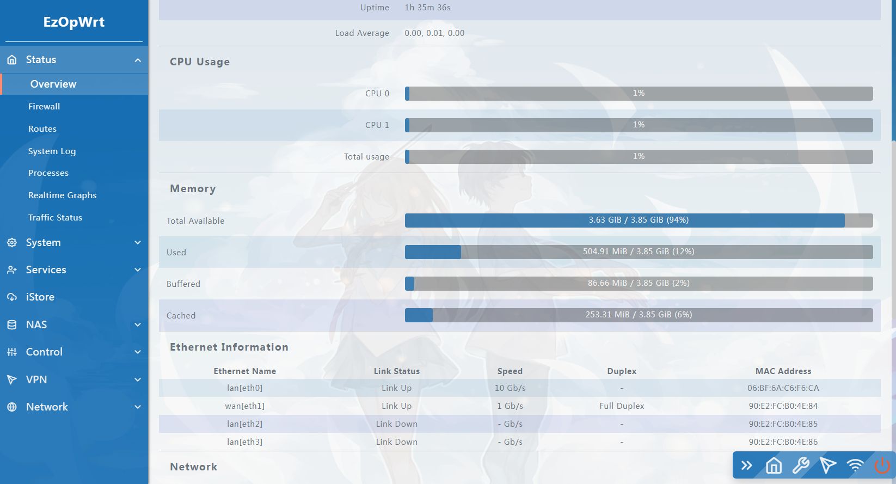
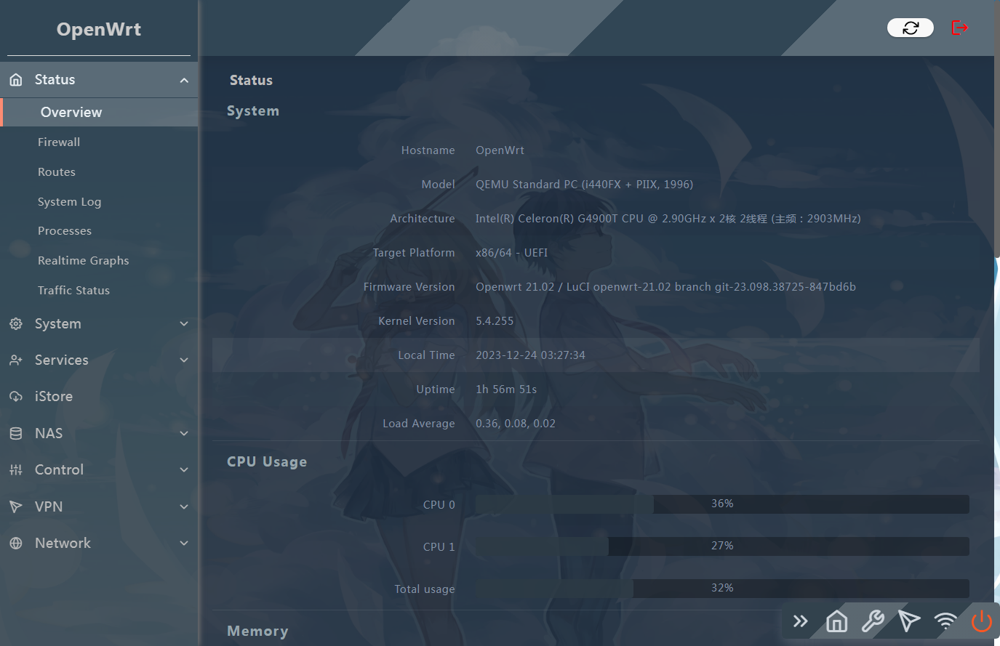
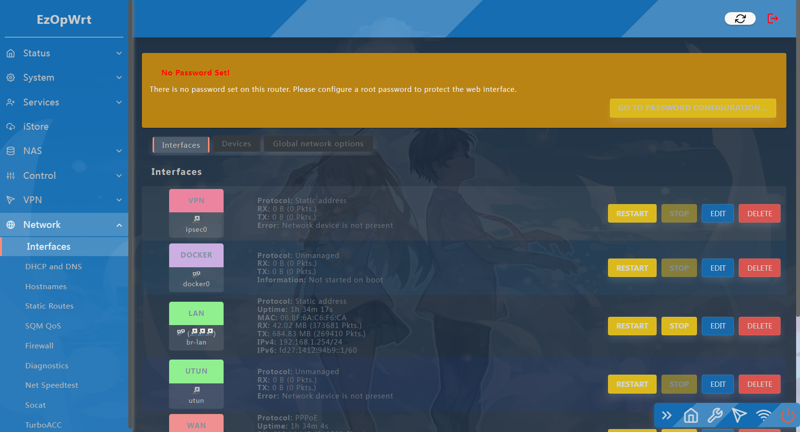
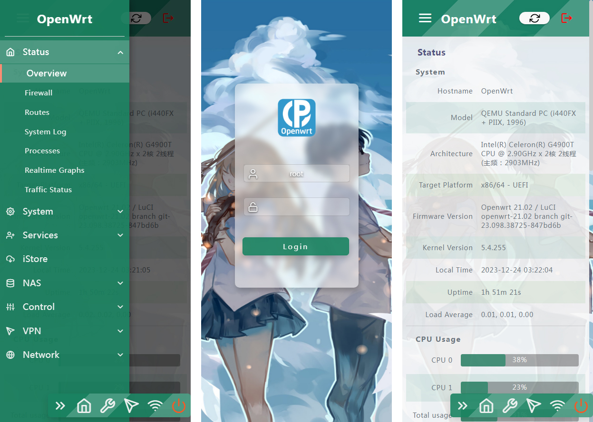
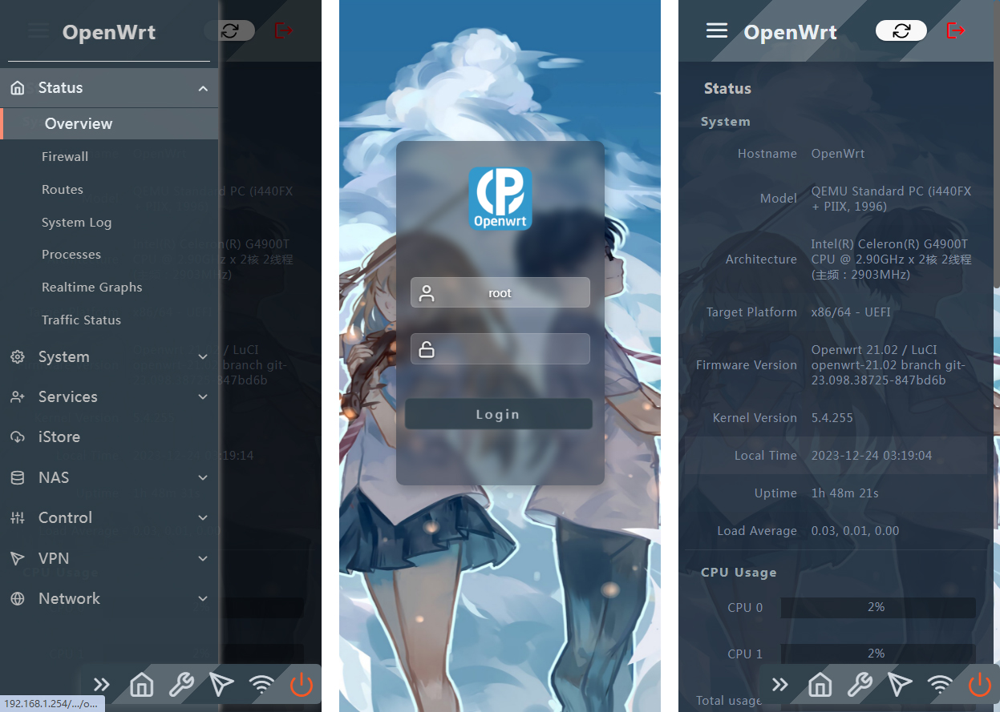
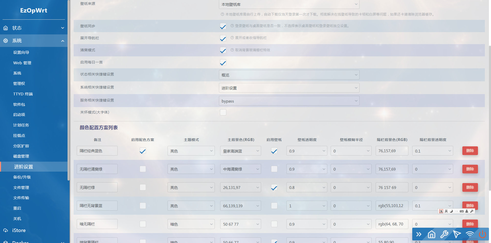
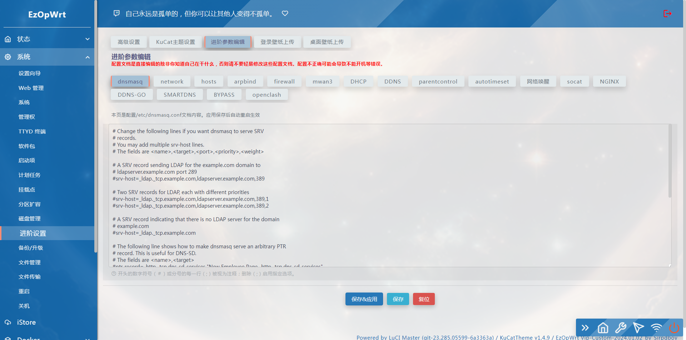
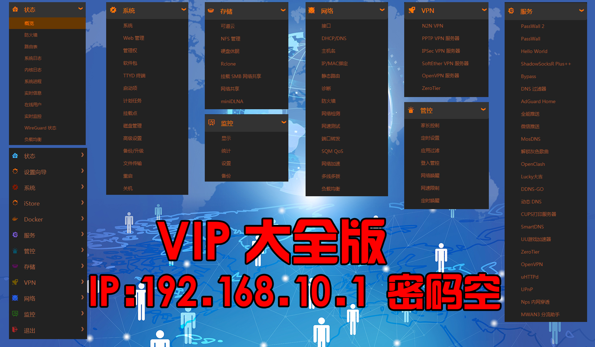
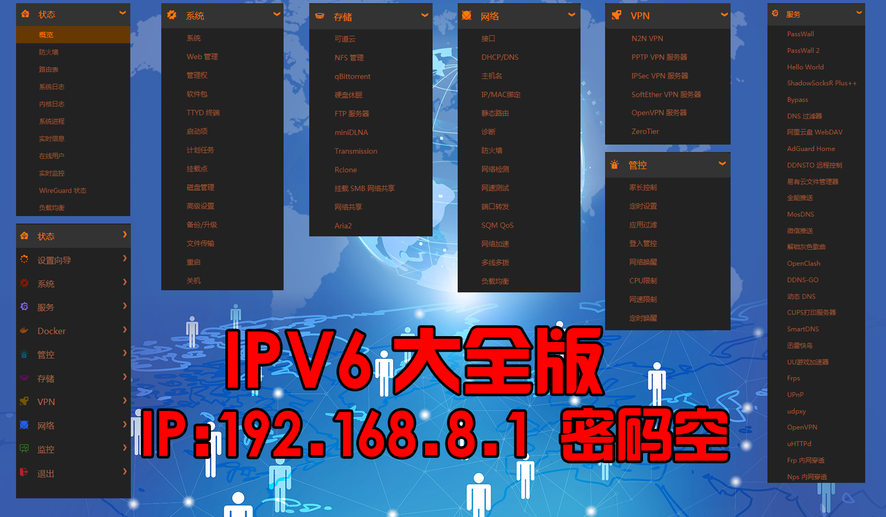
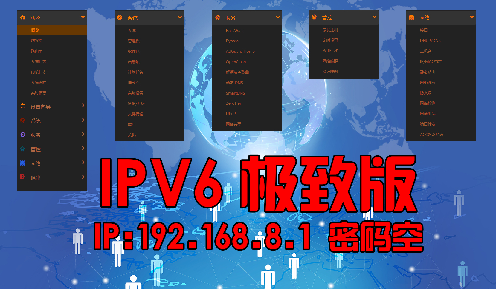

## 访问数：

###  【关于固件BUG说明】固件内核和依赖不断更新升级，编译也是不断纠错和进步之中，新固件会有新插件、也会加入新功能、也许会有新问题，但总之要相信，代码的升级，总是解决前面的问题才会更新，一切都是在朝前进，有问题慢慢来，别急，总有解决方法 。也许本人不是最会处理BUG的编译者，也不是能解决所有BUG的大神，但肯定是最用心来编译固件的编译者。因为每一次更新编译，本人都会不断尝试与改进，加入新功能解决旧问题，方便使用和好用的固件一直是本人编译固件的崇旨。在感谢所有支持本人的好伙伴们！只是本人就不明白为什么 在恩山论坛上有人故意抹黑说：加入VIP群说有BUG就被踢了，此事纯属造谣，在VIP群的所有发电爱好者都可以为本人做证，到目前VIP群还没有踢过人，群众的眼睛是雪亮的，固件好不好用，用不用心编译大家也可以从我发布的固件中体会出来。清者自清！本人问心无愧！！

- 请尽量按月购买。杜绝跑路风险。机场跑路无法控制，只能控制自己的手，如果你按年付也无问题，请在使用一段时间有充分信任之后再决定。

### [sirpdboy  X86固件分为：大全版，精典版，旁路由版，极致版，养老版等，其它如R2S、N1、小米硬路由机器等都是精典版，需要更多服务请定制！](https://github.com/sirpdboy/openwrt18.06/)
### 使用本固件前，请严格遵守国家互联网使用相关法律规定,不要违反国家法律规定！
<!-- TOC -->

  - [目录](#readme)
  - [免责声明](#免责声明)
  - [固件特色](#固件特色)
  - [文件说明](#文件说明)
  - [登陆密码](#登陆密码)  
  - [更新记录](#更新记录) 
  - [固件下载](#固件下载)
  - [固件界面](#固件界面)
  - [插件详情](#插件详情)
  - [源码来源](#源码来源)
  - [刷机教程](#刷机教程)
  - [捐助](#捐助) 

<!-- /TOC -->

------------------------------------------------------
请 **认真阅读完毕** 本页面，本页面包含注意事项和如何使用。

### 恩山链接2020年 ：https://www.right.com.cn/forum/thread-4013563-1-1.html
### 恩山链接2021年 ：https://www.right.com.cn/forum/thread-4053752-1-1.html
### 恩山链接2022年 ：https://www.right.com.cn/forum/thread-8250453-1-1.html
### 恩山链接2025年（最新） ： https://www.right.com.cn/forum/thread-8416671-1-1.html

## 免责声明

- 1.仅限完全行为能力人使用本固件，使用本固件即视为使用者的自愿行为;**
- 2.本人不对任何人因使用本固件所遭受的任何理论或实际的损失承担责任;**
- 3.本人不保证固件的普适性，不保证无bug，不保证绝对的安全稳定。**

## 本固件只在恩山论坛免费发布，未经许可，严禁私自扩散，严禁在淘某宝上出售本固件！ 

## 因精力有限不提供任何技术支持和教程等相关问题解答。不保证插件完全无BUG，特此公告！ 
 
- 1、固件上传之前，都是亲自有测试，不排除测试不全面有问题的可能**
- 2、本固件本人保证没加入任何后门**
- 3、强烈建议不保留配置刷入本固件，可以减少很多问题，如果此前是刷的本人固件可以同版本保留配置升级**
- 4、因为固件是在线编译，”IMG写盘工具“支持不太好，提示错误不影响正常使用，可直接压缩包升级或者用网盘中命令行刷机工具**
- 5、不管什么问题请先自己学习研究再寻求帮助，群里的人没有义务来帮你以及回复一些无聊与无知的问题，需要帮助的可以去某**

## 固件特色

【sirpdboy固件十大特色】
- 1.更简单的设置向导，可向导中一键设置：PPPOE拨号、上级路由、旁路由、以及IPV4和IPV6等设置。
- 2.固件自动绑定WAN口(默认eth1为WAN口)以外的所有网口为LAN口。免除刷机后只有一个LAN口(eth0)接口需要插拨网线的烦恼。
- 3.更详细的预览首页，显示连接网卡的接口和MAC，显示在线机器信息和更详细的物理硬件信息。
- 4.更高效的好用的管控插件：家长控制、网速限制、应用过滤、登陆管制以及更傻瓜的计划重启、关机、重连网络等定时控制管制功能。
- 5.完善的网络速度测试插件，网络检测工具（可设置断网重连），端口转发等工具。
- 6.所有版本集成分区扩容插件。新手福音，老手必备工具！自动网络挂载、自动高效的samba4网络文件共享，最大化开发出软路由NAS的网络传输性能。
- 7.CUPS的网络打印共享服务，更大化利用USB打印机，实现手机无线打印。
- 8.更傻瓜和高效的DDNS-GO动态域名服务，支持IPV4和IPV6协议，支持阿里，腾讯，华为等9大运营商。
- 9.驱动支持绝大多数的网卡和USB网卡，带部分无线网卡驱动。
- 10.集成时下流行的6种流学工具，根据不同需要有不同的版本，插件数量：Plus大全版>Mini精简版>Super极致版。

## 文件说明

- 文件下载请看日期文件名内容下载;
- 如文件名中：20200514表示是编译时间是2020年5月14日;
- 如文件名中：有IPV6表示支持IPV6的固件;
- 如文件名中：有EFI表示支持EFI快速引导模式，否则是标准BIOS模式;
- 如文件名中：有mini表示精简版本、Super表示极致版，Plus表示大全版，Bypass表示旁路由。
- 如文件名中：有R2S表示R2S机器使用版本
- 本固件基于lean大佬的源码编译。在此感谢所有无私奉献源码的大佬们！
 
## 登陆密码

- 2022年3月20日之前【固件IP】：192.168.1.1  密码： password或者 密码空
- 2022年3月20日之后【固件IP】：192.168.8.1  密码无 
- VIP版固件【IP】：192.168.8.1  密码无 

## 更新记录

## 2025年5月1日 更新  进入本群固件交流群：https://t.me/+RV6mxIxZJVDByibQ   【与更多好伙伴一起聊天侃地】【sirpdboy独家优化】
- VIP大全23.05分支PLUS版6.6内核/应用商店/docker/2G分区
- VIP旁路由23.05分支MINI版6.6内核/应用商店/docker/2G分区
- VIP精简24.10分支MINI版6.6内核/应用商店/docker/2G分区
- VIP极致24.10分支SUPER版6.6内核/无应用商店/无docker/2G分区
- VIP R2S 版23.05分支6.6内核 /无应用商店/docker /2G分区
- VIP R4S 版23.05分支6.6内核 /无应用商店/docker/2G分区
- VIP R4SE 版23.05分支6.6内核/无应用商店/docker/2G分区
- VIP R5C 版23.05分支6.6内核/无应用商店/docker/2G分区
- VIP R5S 版23.05分支6.6内核/无应用商店/docker/2G分区
- VIP R6S 版23.05分支6.6内核/无应用商店/docker/2G分区
- VIP R6C 版23.05分支6.6内核/无应用商店/docker/2G分区

##在上一版本的基础上优化更新如下：
- 1.升级【adguardhome】采用全功能版，修正XZ有时候解压不成功等问题。
- 2.升级 网易云，MINI带网易云。
- 3.升级 显卡驱动，默认集成intel和AMD显卡。
- 4.解决目前已知所有问题，更多细节优化请自行刷机体验。

## 2025年2月9日 更新  进入本群固件交流群：https://t.me/+RV6mxIxZJVDByibQ   【与更多好伙伴一起聊天侃地】【sirpdboy独家优化】
- VIP大全23.05分支PLUS版6.6内核/应用商店/docker/2G分区（可进阶设置-加载插件-加载 应用商店、docker和所有驱动）/2G
- VIP精简istoreos-23.05分支MINI版5.15内核（可进阶设置-加载插件-加载 应用商店、docker和所有驱动）/2G
- VIP旁路21.02分支BYPASS版5.4内核（可进阶设置-加载插件-加载 应用商店、docker和所有驱动）/2G
- VIP极致23.05分支SUPER版6.6内核（可进阶设置-加载插件-加载 应用商店、docker和所有驱动）/2G
- VIP R2S 版23.05分支6.1内核 /应用商店/docker /2G
- VIP R4S 版23.05分支6.1内核 /应用商店/docker/2G
- VIP R4SE 版23.05分支6.1内核/应用商店/docker/2G
- VIP R5C 版23.05分支6.1内核/应用商店/docker/2G
- VIP R5S 版23.05分支6.1内核/应用商店/docker/2G

## 在上一版本的基础上优化更新如下：

- 1. 普通版的三个版本更新停止，开放VIP极致SUPER版本在线更新。
- 2. 所有版本增加在线升级插件 ，如果不能在线更新请设置好翻墙插件再更新。
- 3. 极致版增加wman3和多拨插件，内核5.15和6.6交替更新。
- 4. 修复极致版 进阶设置，主题设置中上传页面依赖错误问题。 
- 5. 升级DDNS-GO到5.8.1版本。
- 6. 更多功能自行体验。

- 【插件数排序】：【PLUS大全】集成插件最多  >【BYPASS旁路】常用插+不常用插件+不带多拨负载均衡  >【MINI精典】常用插件+多拨负载均衡  >【SUPER极致】常用插件不带多拨  
- 【VIP版】：带商店ISTORE ， 带有线和无线驱动可后台SSH装载所有驱动【在SSH后台菜单10号功能装入】， 带DOCKER【在SSH后台菜单11号功能装入】
- 【普通版极致版】：带有线和无线驱动可后台SSH装载所有驱动【在SSH后台菜单10号功能装入】，插件相对VIP版来说少一些。带进阶设置.

## 固件下载

- 【在线更新】VIP极致SUPER版下载地址：https://github.com/sirpdboy/openwrt/releases
  
- 【123网盘工具下载】： https://www.123pan.com/s/dS5A-6qxqd.html  提取码: qnm4

- 【123网盘固件下载】主下载:  https://www.123865.com/s/dS5A-D5Nqd 提取码:B2HS   备份下载： https://www.123684.com/s/dS5A-D5Nqd 提取码:B2HS

-  Telegram聊天群组: https://t.me/joinchat/RV6mxIxZJVDByibQ

-  加入固件电报群：https://t.me/joinchat/AAAAAEpRF88NfOK5vBXGBQ 

## 固件界面

## 插件详情

## 源码来源

***本固件基于lean大佬的源码编译，外加一些额外的软件包，主要使用源码如下：***
### https://github.com/coolsnowwolf/lede
### https://github.com/sirpdboy/sirpdboy-package (sirpdboy插件源码仓库）

## 使用与授权相关说明
 
- 本人开源的所有源码，任何引用需注明本处出处，如需修改二次发布必告之本人，未经许可不得做于任何商用用途。

# My other project

- 路由安全看门狗 ：https://github.com/sirpdboy/luci-app-watchdog
- 网络速度测试 ：https://github.com/sirpdboy/luci-app-netspeedtest
- 计划任务插件（原定时设置） : https://github.com/sirpdboy/luci-app-taskplan
- 关机功能插件 : https://github.com/sirpdboy/luci-app-poweroffdevice
- opentopd主题 : https://github.com/sirpdboy/luci-theme-opentopd
- kucat酷猫主题: https://github.com/sirpdboy/luci-theme-kucat
- kucat酷猫主题设置工具: https://github.com/sirpdboy/luci-app-kucat-config
- NFT版上网时间控制插件: https://github.com/sirpdboy/luci-app-timecontrol
- 家长控制: https://github.com/sirpdboy/luci-theme-parentcontrol
- 定时限速: https://github.com/sirpdboy/luci-app-eqosplus
- 系统高级设置 : https://github.com/sirpdboy/luci-app-advanced
- ddns-go动态域名: https://github.com/sirpdboy/luci-app-ddns-go
- 进阶设置（系统高级设置+主题设置kucat/agron/opentopd）: https://github.com/sirpdboy/luci-app-advancedplus
- 网络设置向导: https://github.com/sirpdboy/luci-app-netwizard
- 一键分区扩容: https://github.com/sirpdboy/luci-app-partexp
- lukcy大吉: https://github.com/sirpdboy/luci-app-lukcy

## 捐助

|       |    | 
| :-----------------: | :-------------: |
| |  |

## 刷机教程

## DD刷机教程 ：

