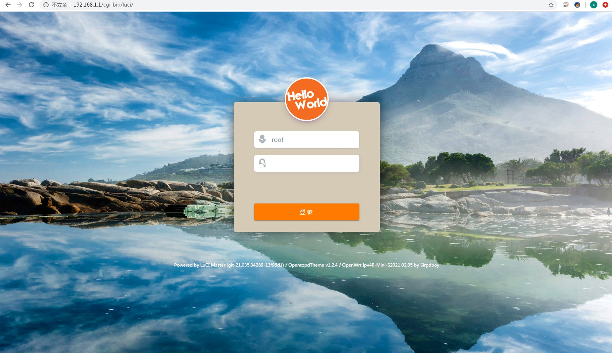
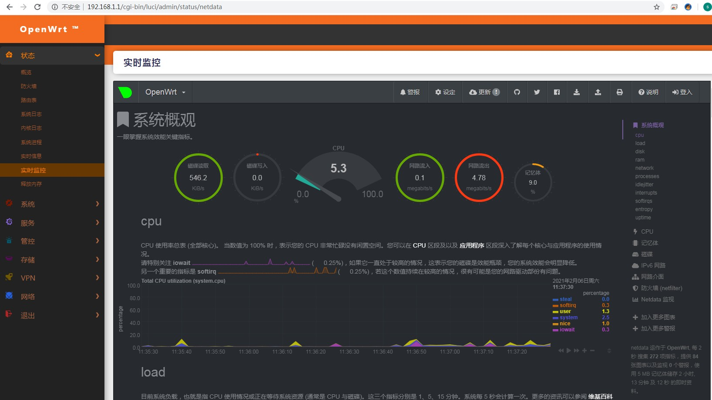
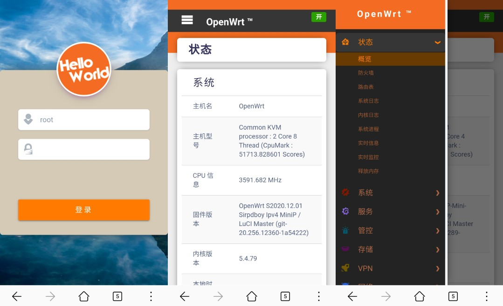

 

欢迎来到sirpdboy的源码仓库！
=
Welcome to sirpdboy's  git source of packages
-
[sirpdboy  固件分为：大全版，精典版，旁路由版本](https://github.com/sirpdboy/openwrt18.06/)
==========================================

     

请 **认真阅读完毕** 本页面，本页面包含注意事项和如何使用。

## 写在前面：
本固件只在恩山论坛免费发布，禁止商业用途！这只是个人爱好免费发布，不接受任何捐赠！
因精力有限不提供任何技术支持和教程等相关问题解答。不保证插件完全无BUG，特此公告！

恩山链接 ：https://www.right.com.cn/forum/thread-4053752-1-1.html
============================
**【免责声明】*
1.仅限完全行为能力人使用本固件，使用本固件即视为使用者的自愿行为;
2.本人不对任何人因使用本固件所遭受的任何理论或实际的损失承担责任;
3.本人不保证固件的普适性，不保证无bug，不保证绝对的安全稳定。
============================
本固件基于lean大佬的源码编译，外加一些额外的软件包，主要使用源码如下：
https://github.com/coolsnowwolf/lede
https://github.com/Lienol/openwrt-package
https://github.com/sirpdboy/sirpdboy-package (带定时关机源码）

### 固件说明  
============================
1、固件上传之前，都是亲自有测试，不排除测试不全面有问题的可能;
2、本固件本人保证没加入任何后门;
3、强烈建议不保留配置刷入本固件，可以减少很多问题，如果此前是刷的本人固件可以同版本保留配置升级;
4、github仓库中下载文件说明：     SirpdboyOpenWrt-IPV6-Firmware此是固件下载,
     SirpdboyOpenWrt-IPV6-Ipk此文件本固件中所有常见插件单独安装文件打包全下载。
5、因为固件是在线编译，”IMG写盘工具“支持不太好，提示错误不影响正常使用，可直接压缩包升级或者用网盘中命令行刷机工具;
6、8.25号开始取消应用过滤，因为插件使用冲突较多，源码未修复问题前不会再加入。
7、不明白的请TG群咨询或者度娘；
8、好用的话请评分支持，可以让更多人了解和看到;
9、关于为什么回复才能看到下载问题：因为不回复，本贴就会沉了去;

### 补充说明：
============================
文件下载请看日期文件名内容下载;
如文件名中：20200514表示是编译时间是2020年5月14日;
如文件名中：有IPV6表示支持IPV6的IP转发;
如文件名中：有EFI表示支持EFI快速引导模式，否则是标准BIOS模式;
如文件名中：有mini表示精简版本
 
### openwrt 登陆信息 
---------------------------------------------------------------------------------------  

初始管理地址：192.168.1.1       初始管理密码：password   
=
---------------------------------------------------------------------------------------
### 固件下载地址：

蓝奏云下载（拒绝百度云）
链接：https://sipdboy.lanzous.com/b01bcwirc  密码：a1s0（回复可见）
谷歌云下载链接：https://drive.google.com/drive/folders/1hslY_Pbdy-R-EAEVRMuaZvxUx_jOfje-
加入固件电报群：https://t.me/joinchat/AAAAAEpRF88NfOK5vBXGBQ
--------------------------------------------------------------
欢迎加入更新订阅频道，获取最新更新信息。 本固件本人保证没加入任何后门，均采用开源代码进行编译，自愿刷入，不对任何人因刷入本固件所遭受的任何理论或实际的损失承担责任。
---------------------------------------------------------------------------------------------------------------------------------

## 说明 

源码来源：https://github.com/sirpdboy/sirpdboy-package

感谢LEAN大，感谢LEO大 等大神分享源码，你可以随意使用其中的源码，但请注明出处。
============================

# My other project
网络速度测试 ：https://github.com/sirpdboy/NetSpeedTest

定时关机重启 : https://github.com/sirpdboy/luci-app-autopoweroff

关机功能插件 : https://github.com/sirpdboy/luci-app-poweroffdevice

opentopd主题 : https://github.com/sirpdboy/luci-theme-opentopd

opentoks 主题: https://github.com/sirpdboy/luci-theme-opentoks [仿KOOLSAHRE主题]

btmob 主题: https://github.com/sirpdboy/luci-theme-btmob

系统高级设置 : https://github.com/sirpdboy/luci-app-advanced

## 捐助  

**如果你觉得此项目对你有帮助，请捐助我们，以使项目能持续发展，更加完善。··请作者喝杯咖啡~~~**

**你们的支持就是我的动力！**

### 捐助方式

|       |    | 
| :-----------------: | :-------------: |
|||

###### [解决 Github 网页上图片显示失败的问题](https://blog.csdn.net/qq_38232598/article/details/91346392)

