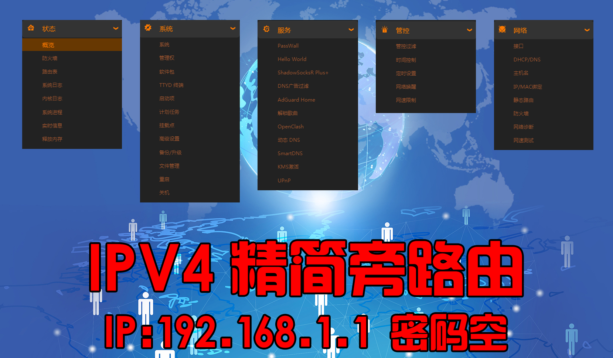
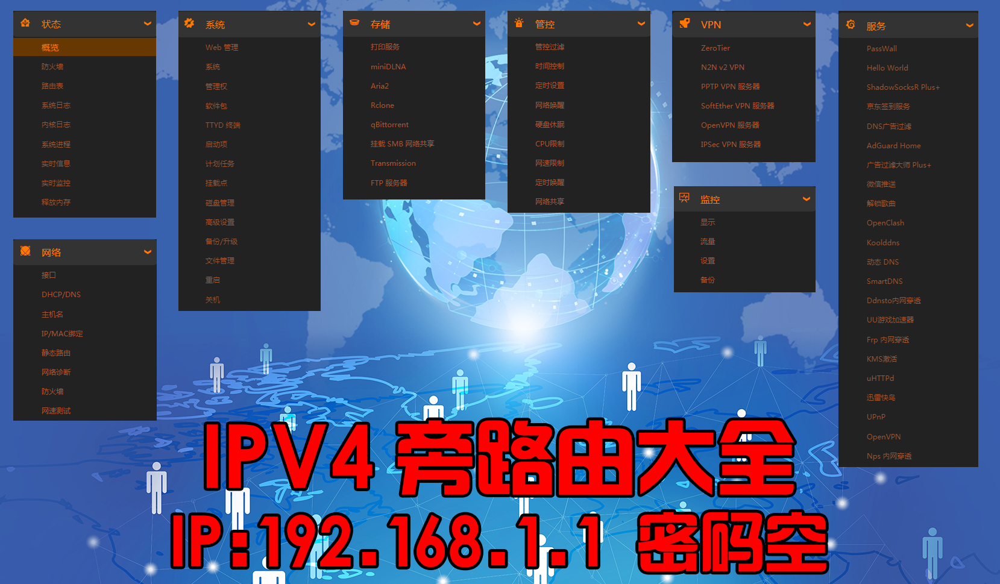
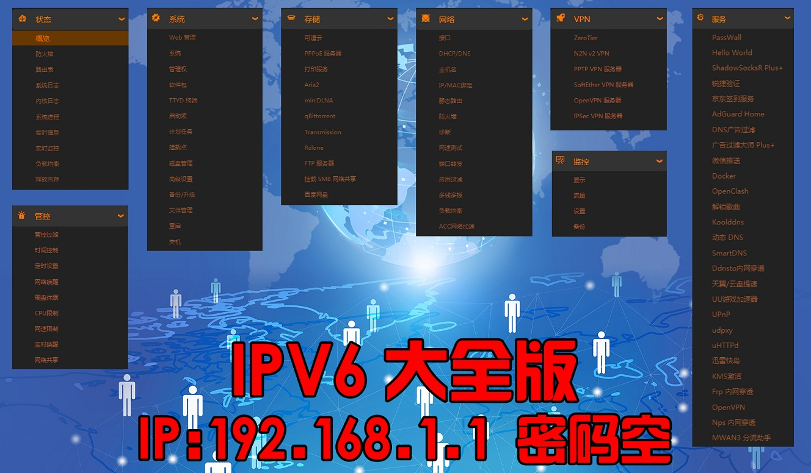
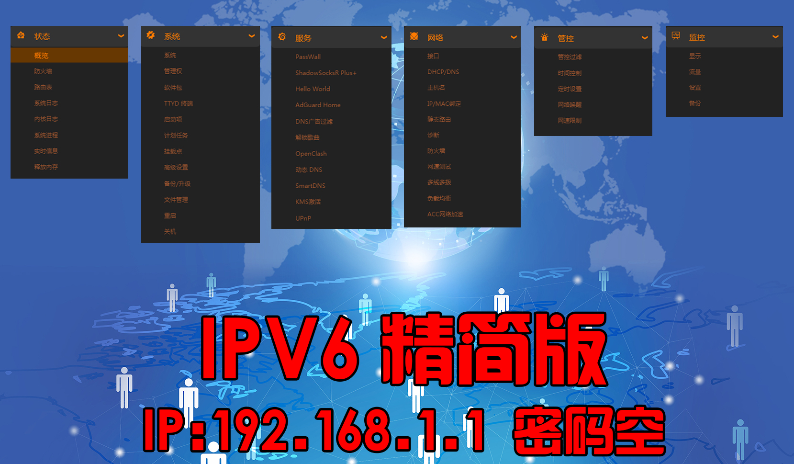
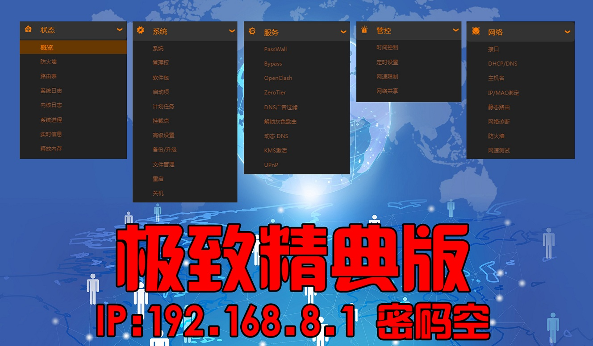

 

欢迎来到sirpdboy的源码仓库！
=
Welcome to sirpdboy's  git source of packages
-
### [sirpdboy  固件分为：大全版，迷你版，旁路由版，养老版等几个版本](https://github.com/sirpdboy/openwrt18.06/)

       

------------------------------------------------------

请 **认真阅读完毕** 本页面，本页面包含注意事项和如何使用。

**本固件只在恩山论坛免费发布，未经许可，严禁私自扩散，严禁在淘某宝上出售本固件！！**

**因精力有限不提供任何技术支持和教程等相关问题解答。不保证插件完全无BUG，特此公告！**

### 恩山链接 ：https://www.right.com.cn/forum/thread-4053752-1-1.html

## 【免责声明】
**1.仅限完全行为能力人使用本固件，使用本固件即视为使用者的自愿行为;**

**2.本人不对任何人因使用本固件所遭受的任何理论或实际的损失承担责任;**

**3.本人不保证固件的普适性，不保证无bug，不保证绝对的安全稳定。**

----------------------------------------------------

***本固件基于lean大佬的源码编译，外加一些额外的软件包，主要使用源码如下：***

### https://github.com/coolsnowwolf/lede

### https://github.com/sirpdboy/sirpdboy-package (带定时关机源码）

### 固件说明  

1、固件上传之前，都是亲自有测试，不排除测试不全面有问题的可能**

2、本固件本人保证没加入任何后门**

3、强烈建议不保留配置刷入本固件，可以减少很多问题，如果此前是刷的本人固件可以同版本保留配置升级**

4、因为固件是在线编译，”IMG写盘工具“支持不太好，提示错误不影响正常使用，可直接压缩包升级或者用网盘中命令行刷机工具**

5、不管什么问题请先自己学习研究再寻求帮助，群里的人没有义务来帮你以及回复一些无聊与无知的问题，需要帮助的可以去某**

### 补充说明：

--------------------------------------------------------------

**文件下载请看日期文件名内容下载**

**如文件名中：20200514表示是编译时间是2020年5月14日**

**如文件名中：有IPV6表示支持IPV6的固件**

**如文件名中：有EFI表示支持EFI快速引导模式，否则是标准BIOS模式**

**如文件名中：有mini表示精简版本**

**如文件名中：有P表示旁路由版本**

**如文件名中：有JZ表示极致精典版本**
 
### openwrt 登陆信息 

---------------------------------------------------------------------------------------  

**固件IP：192.168.1.1  密码： password或者 密码空

**极致版IP:192.168.8.1  密码空 

---------------------------------------------------------------------------------------

### openwrt 插件版本详细说明 

## 2021-12-9更新：（IPV6大全版5.4.162内核【带DOCKER】 + IPV6精简版5.4.162内核 + IPV6极致版5.10.87内核 ）[养老版]

一.同步更新所有源码和插件到2021年12月9日

二.目前镜像包极致版170兆，精简版和大全版984兆。

三.基本保持上个固件分类和插件，大体上不变。

四.更新内容如下：【在上个版本的基础上优化更新如下】

1.更新最新OPETOPD主题1.4.8无BUG版本。修复进后台白屏问题，进步精简主题代码，清除一些重复未使用的代码。

2.增加最新iKoolProxy滤广告插件

3.增加全能推送插件。

4.增加微信推送插件。

5.修复网络共享自动共享ROOT问题。

6.更新AdGuard Home到最新版本,修改用户配置文件位置到/etc/config目录，方便备份恢复

7.极致版本内核为5.10.87版本。

8.大全版增加SQM QOS队列管理 插件

9.应TG群机友建议，极致版增加流量监控插件。

10.修复上一版本切换到英文状态无法切回中文问题。

五.目前版本都有刷机测试，插件都能正常启用，力求完善少BUG，很多插件都是本人修复优化插件，具体功能请自行测试。

六.如果出国了可能导致插件失效：如统计流量、限速和时间控制等

七.如果是老版本升级建议全新刷机升级。

### 固件下载地址：

**蓝奏云下载（拒绝百度云）**
 
【123云盘最新版本下载】链接:https://www.123pan.com/s/dS5A-By4qd 提取码:SeY7

【123网盘新历史版本下载】链接:https://www.123pan.com/s/dS5A-Yy4qd 提取码:RKht

【蓝奏云老历史版本下载链接】：https://sipdboy.lanzoui.com/b01bjtbjg    密码:bcxz

【谷歌云老历史版本下载链接】：https://drive.google.com/drive/folders/1hslY_Pbdy-R-EAEVRMuaZvxUx_jOfje-

**Telegram聊天群组: https://t.me/joinchat/RV6mxIxZJVDByibQ

**加入固件电报群：https://t.me/joinchat/AAAAAEpRF88NfOK5vBXGBQ 

--------------------------------------------------------------

## 说明 

源码来源：https://github.com/sirpdboy/sirpdboy-package

**感谢LEAN大，感谢Lienol大 等大神分享源码，你可以随意使用其中的源码，但请注明出处。**

# My other project

网络速度测试 ：https://github.com/sirpdboy/NetSpeedTest

定时关机重启 : https://github.com/sirpdboy/luci-app-autotimeset

关机功能插件 : https://github.com/sirpdboy/luci-app-poweroffdevice

opentopd主题 : https://github.com/sirpdboy/luci-theme-opentopd

opentoks 主题: https://github.com/sirpdboy/luci-theme-opentoks [仿KOOLSAHRE主题]

btmob 主题: https://github.com/sirpdboy/luci-theme-btmob

系统高级设置 : https://github.com/sirpdboy/luci-app-advanced

## 捐助  

**如果你觉得此项目对你有帮助，请捐助我们，以使项目能持续发展，更加完善。··请作者喝杯咖啡~~~**

**你们的支持就是我的动力！**

------------------------------

## 捐助名单

**p*k                  捐助50元

**KK                   捐助600元

**潮                   捐助50元

------------------------------

### 捐助方式

|       |    | 
| :-----------------: | :-------------: |
|||

## DD刷机教程 ：

###### [解决 Github 网页上图片显示失败的问题](https://blog.csdn.net/qq_38232598/article/details/91346392)

