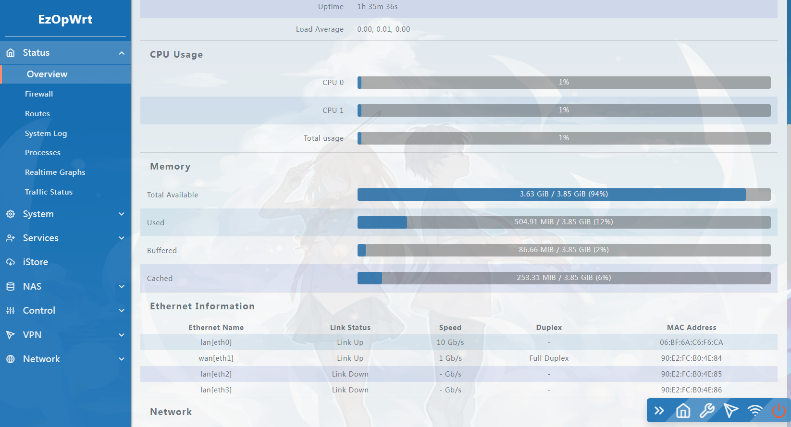
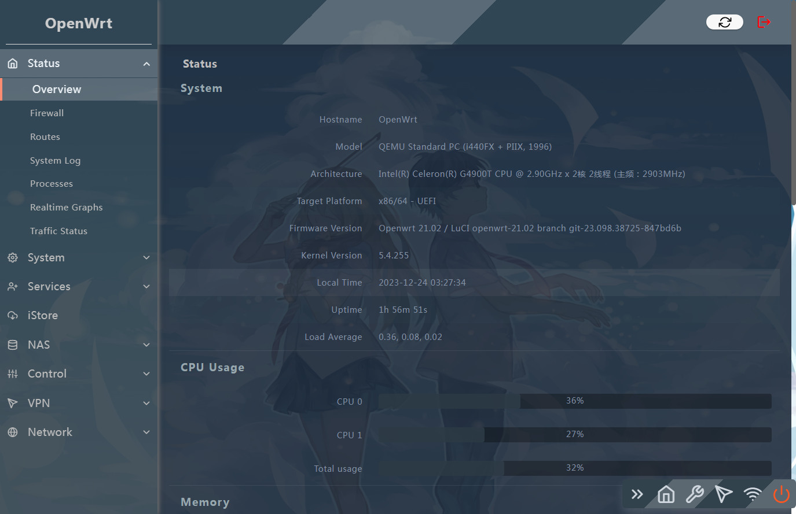
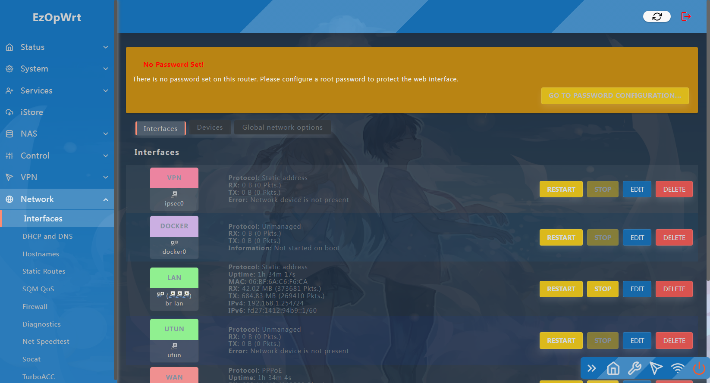
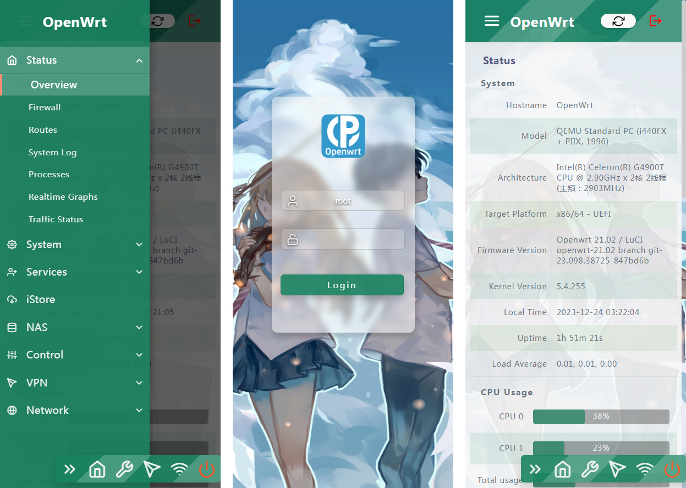
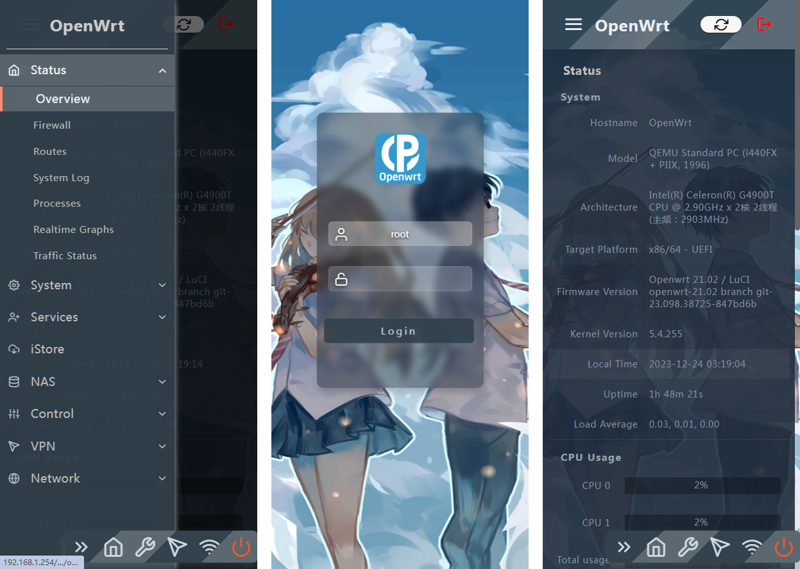
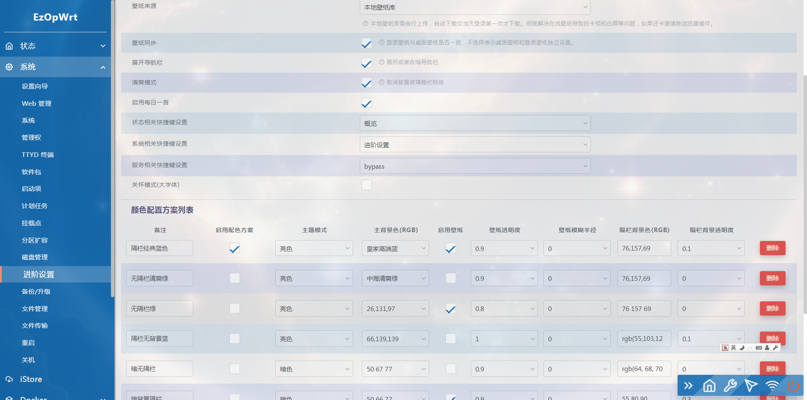
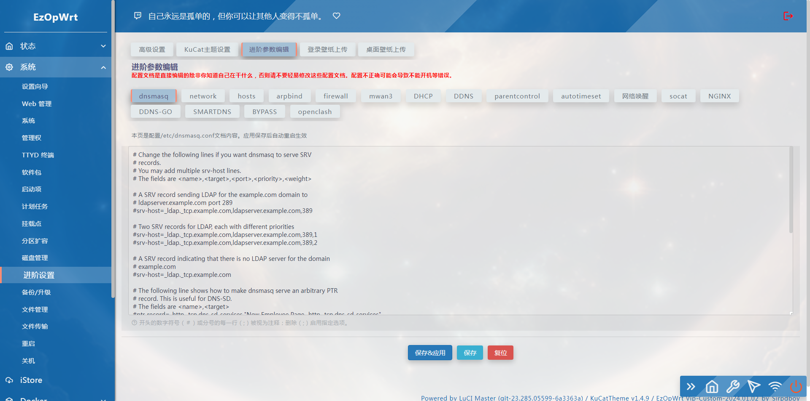
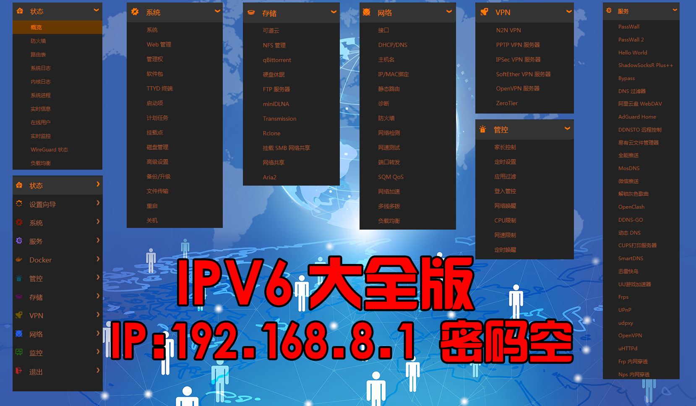

## 访问数：

## 【关于 sirpdboy/luci-app-netspeedtest 开源仓库事件的通告】

  - 因 luci-app-netspeedtest 仓库近期更新时，在 JS 版本测速插件中误用了部分文件，导致被指侵权，目前原仓库暂时无法访问。
  - 应好伙伴们的要求，现已开放最新的临时测速源码地址：👉 https://github.com/sirpdboy/netspeedtest
  - 本插件最早由我于 2019 年开发并发布，是【OPENWRT 平台上最早】系统性研究和整合网络测速功能的人，并一直持续更新维护至今。
  - 这次事件也波及到了多个其他仓库，对此我深表遗憾。
  - 我个人的 GitHub 仓库中，有十几个开源的插件，每一个都是经过无数个日夜、一点点熬出来的，熬出了一身病，也熬出了一份执着。
  - 开发过程中，代码间相互参考、借鉴他人经验，本是开源社区的常态，也是开源精神的体现：互相学习，共同进步。
  - 关于 luci-app-netspeedtest 仓库，我们在说明中已标明部分代码的参考来源。
  - 唯一的问题是，之前在维护过程中，有一个 License 文件确实因操作失误填错了，我当时是在网页端直接操作，处理上可能不够严谨，恳请大家理解。
  - 即便是被指“抄袭”的 speedtest.js 文件，前段时间我们也已补充了参考来源，该文件也绝不是简单复制粘贴而来的。
  - 希望大家能尊重事实，理性看待问题，文明交流，少一点戾气，多一份理解。
  - 我们都是开源社区的搬运工，做点东西不容易，没必要动辄上纲上线。当然本人也欢迎大家批评与监督！如果有侵犯到您的代码，请告之我们，我们第一时间改正！

  - 【最近感觉】：风雨飘摇，且用且珍惜吧。 

  - 最后补一下：如果您认为本人插件还行，还值得继续更新的话，请给本人仓库中的插件一个免费的小星星！这是对本人付出的有力肯定与支持！！谢谢大家 ！！

  - sirpdboy
  - 2026年3月7日

### [sirpdboy  X86固件分为：大全版，精典版，旁路由版，极致版，养老版等，其它如R2S、N1、小米硬路由机器等都是精典版，需要更多服务请定制！](https://github.com/sirpdboy/openwrt18.06/)
### 使用本固件前，请严格遵守国家互联网使用相关法律规定,不要违反国家法律规定！
<!-- TOC -->

  - [目录](#readme)
  - [免责声明](#免责声明)
  - [固件特色](#固件特色)
  - [文件说明](#文件说明)
  - [登陆密码](#登陆密码)  
  - [更新记录](#更新记录) 
  - [固件下载](#固件下载)
  - [固件界面](#固件界面)
  - [插件详情](#插件详情)
  - [源码来源](#源码来源)
  - [刷机教程](#刷机教程)
  - [捐助](#捐助) 

<!-- /TOC -->

------------------------------------------------------
请 **认真阅读完毕** 本页面，本页面包含注意事项和如何使用。

### 恩山链接2020年 ：https://www.right.com.cn/forum/thread-4013563-1-1.html
### 恩山链接2021年 ：https://www.right.com.cn/forum/thread-4053752-1-1.html
### 恩山链接2022年 ：https://www.right.com.cn/forum/thread-8250453-1-1.html
### 恩山链接2025年 ： https://www.right.com.cn/forum/thread-8416671-1-1.html
### 恩山链接2026年（最新） ：https://www.right.com.cn/forum/thread-8465304-1-1.html

## 免责声明

- 1、仅限完全行为能力人使用本固件，使用本固件即视为使用者的自愿行为;**
- 2、本人不对任何人因使用本固件所遭受的任何理论或实际的损失承担责任;**
- 3、本人不保证固件的普适性，不保证无bug，不保证绝对的安全稳定。**
- 4、固件上传之前，都是亲自有测试，不排除测试不全面有问题的可能**
- 5、本固件本人保证没加入任何后门**
- 6、强烈建议不保留配置刷入本固件，可以减少很多问题，如果此前是刷的本人固件可以同版本保留配置升级**

## 固件特色

【sirpdboy固件十大特色】
- 1.更简单的设置向导，可向导中一键设置：PPPOE拨号、上级路由、旁路由、以及IPV4和IPV6等设置。
- 2.固件自动绑定WAN口(最后一个口为WAN口)以外的所有网口为LAN口。免除刷机后只有一个LAN口(eth0)接口需要插拨网线的烦恼。
- 3.更详细的预览首页，显示连接网卡的接口和MAC，显示在线机器信息和更详细的物理硬件信息。
- 4.更高效的好用的管控插件：时间控制、网速限制、看门狗以及更傻瓜的计划重启、关机、重连网络等定时控制管制功能。
- 5.完善的网络速度测试插件，网络检测工具（可设置断网重连），端口转发等工具。
- 6.所有版本集成分区扩容插件。新手福音，老手必备工具！自动网络挂载、自动高效的samba4网络文件共享，最大化开发出软路由NAS的网络传输性能。
- 7.强烈建议使用酷猫（kucat）主题，可自定义：主题颜色、桌面背景、快捷键和菜单项目等内容，。
- 8.更傻瓜和高效的DDNS-GO动态域名服务，支持IPV4和IPV6协议，支持阿里，腾讯，华为等9大运营商。
- 9.可以在进阶设置中，动态加载：docker,应用商店和全部驱动。
- 10.集成时下流行的6种流学工具，根据不同需要有不同的版本，插件数量：Plus大全版>Mini精简版>Super极致版。

## 文件说明

- 文件下载请看日期文件名内容下载;
- 如文件名中：20200514表示是编译时间是2020年5月14日;
- 如文件名中：有IPV6表示支持IPV6的固件;
- 如文件名中：有EFI表示支持EFI快速引导模式，否则是标准BIOS模式;
- 如文件名中：有mini表示精简版本、Super表示极致版，Plus表示大全版，Bypass表示旁路由。
- 如文件名中：有R2S表示R2S机器使用版本
- 本固件基于lean和immortalwrt等大佬的源码编译。在此感谢所有无私奉献源码的大佬们！
 
## 登陆密码

- 2022年3月20日之前【固件IP】：192.168.1.1  密码： password或者 密码空
- 2022年3月20日之后【固件IP】：192.168.8.1  密码无 
- VIP版固件【IP】：192.168.10.1  密码无 

## 更新记录

## 2026年3月7日 最新更新【SIRPDBOY独家优化】
- 【史上最强主题！2026最新kucat酷猫主题继自定义颜色、自定义背景图和自定义快捷键后又出新功能可以【自定义菜单】啦！酷猫主题开创自定义主题新概念！快来尝鲜吧！】
- 使用源码与教程： https://github.com/sirpdboy/luci-theme-kucat

- 【史上最简单！2026最新ezopenwrt固件一键搞定软路由刷机、调试、分区扩容和扩容在线升级，彻底告别麻烦！】：
- bilibili: https://www.bilibili.com/video/BV1BYcEziEn6/?share_source=copy_web&vd_source=ee16245e38db822da2b2a406bfe7c2b6
- youtube:  https://www.youtube.com/watch?v=rkvHv_UccsU

- 在上一版本基础上，新更新内容如下：

- 1. 升级ddns-go v1.6.6版，修复默认重置用户名admin密码admin12345,修复上一版本无法启动问题。
- 2. 升级【管控】中【看门狗】插件，修复黑名单列表显示不正常和停用插件黑名单列表还有效问题！
- 3. 升级【任务设置】JS版，更详细的设置说明，可设置开机启动任务和定时执行任务，带10多个常用功能！
- 4. 升级【kucat主题】v3.3.1版，优化网络接口显示和动态滑动块显示，更方便美观！
- 5. 升级【设置向导】插件，优化新版防火墙和IPV6设置，感谢群友Andrew Johnson和 时空 未来 协助及提供测试结果。
- 6. 升级【网络测速】v5.1.2插件，新增speedtest宽带测速的二种测速方案，测速更方便！

- 【注意】根据虚拟机和实际情况出发，WAN口绑定方案：单网口时eth0为LAN口，多网口最后一个口为WAN其余是LAN口
- 【问题】有问题反馈，请提供截图、详细日志和可重现操作流程，否则一率不回复不处理
- 【公告】欢迎定制各种特殊驱动固件和特殊需要插件以及各种路由器固件。

## 2026年3月1日 最新更新【SIRPDBOY独家优化】
- 【史上最强主题！2026最新kucat酷猫主题继自定义颜色、自定义背景图和自定义快捷键后又出新功能可以【自定义菜单】啦！酷猫主题开创自定义主题新概念！快来尝鲜吧！】
- 使用源码与教程： https://github.com/sirpdboy/luci-theme-kucat

- 【史上最简单！2026最新ezopenwrt固件一键搞定软路由刷机、调试、分区扩容和扩容在线升级，彻底告别麻烦！】：
- bilibili: https://www.bilibili.com/video/BV1BYcEziEn6/?share_source=copy_web&vd_source=ee16245e38db822da2b2a406bfe7c2b6
- youtube:  https://www.youtube.com/watch?v=rkvHv_UccsU

- 在上一版本基础上，新更新内容如下：

- 1. 升级设置向导,取消容易冲突强制转发和HTTPS设置项（默认直接带转发），优化解决docker防火墙设置等一些细节优化。
- 2. 升级kucat主题 v3.3.0 版，右上角加入【自定义菜单】功能切换键，需配合（kucat-config）设置工具 v2.2.0 版使用！
- 3. 升级酷猫主题（kucat-config）设置工具 v2.2.0 版，设置工具同步kucat主题v3.3.0版【自定义菜单】功能！
- 4. 升级ddns-go v1.6.6版，修复未设置用户名时重置导致用户名无效问题，默认重置用户名admin密码admin12345！

- 【注意】根据虚拟机和实际情况出发，WAN口绑定方案：单网口时eth0为LAN口，多网口最后一个口为WAN其余是LAN口
- 【问题】有问题反馈，请提供截图、详细日志和可重现操作流程，否则一率不回复不处理
- 【公告】欢迎定制各种特殊驱动固件和特殊需要插件以及各种路由器固件。

## 2026年2月14日 最新更新【SIRPDBOY独家优化】
- 【小技巧】二步实现扩容升级固件：先用【分区扩容】扩容mnt分区（用于存储解压固件要大于4G）->【在线升级】扩展DD模式 刷机即可。【如果还不会来TG群申请指导】

- 【唯一TG联系人: https://t.me/sirpdboy 】
- 【唯一TG固件更新记录分享频道: https://t.me/sirpdboy_openwrt 】
- 【唯一TG聊天交流群: https://t.me/joinchat/RV6mxIxZJVDByibQ 】
- 【唯一GITHUB源码站: https://www.github.com/sirpdboy 】

## 在上一版本基础上，新更新内容如下：
- 1. 升级PASSWALL到最新版本，解决订阅版本无备注会乱码等问题。
- 2. 升级kucat主题 v3.2.8 版，解决上传图片文件名不能有空格问题，适配bandix和passwall新版本新窗口显示异常问题。
- 3. 升级酷猫主题（kucat-config）设置工具 v2.1.7 版，修复某些LUCI版本，保存设置不生效和上传背景文件不行等问题。
- 4. 升级在线升级插件，增加自动升级扩容到系统全盘功能，尽力优化国内下载速度及卡顿现象，如果太慢建议用科学更新。
- 5. 适配最新源码系统，解决新刷机系统不能SSH登录固件的问题，修复更新源中一个链接无效问题。
- 6. 升级ISO打包方法，缩小压缩包,修复刷机代码提示特定情况不合理等问题。
- 【注意】根据虚拟机和实际情况出发，WAN口绑定方案：单网口时eth0为LAN口，多网口最后一个口为WAN其余是LAN口

- 【问题】有问题反馈，请提供截图、详细日志和可重现操作流程，否则一率不回复不处理
- 【公告】欢迎定制各种特殊驱动固件和特殊需要插件以及各种路由器固件。

## 2026年2月1日 最新更新【SIRPDBOY独家优化】
- 【小技巧】二步实现扩容升级固件：先用【分区扩容】扩容mnt分区（用于存储解压固件要大于4G）->【在线升级】扩展DD模式 刷机即可。【如果还不会来TG群申请指导】

- 【唯一TG联系人: https://t.me/sirpdboy 】
- 【唯一TG固件更新记录分享频道: https://t.me/sirpdboy_openwrt 】
- 【唯一TG聊天交流群: https://t.me/joinchat/RV6mxIxZJVDByibQ 】
- 【唯一GITHUB源码站: https://www.github.com/sirpdboy 】

## 在上一版本基础上，新更新内容如下：
- 1. 升级设置向导v2.1.3，加回强制转发和优化IPV6设置,修复防火墙多区域设置BUG。
- 2. 升级时间控制 v3.2.3，增加IP,MAC列表选择功能。
- 3. 彻底修复源地址更新提示错误的问题，改用immortalwrt软件源。
- 4. 升级网速测试v5.1.1，增加8个网站的在线宽带测速。
- 5. 升级ddns-go v6.15.0 ，修复LUCI无法获取ipv6的前缀问题，日志改为最新日志排在最前面。
- 6. 升级lucky v2.26.1 ，修复LUCI汉化不全，设置控制台默认操作台。
- 7. 修复OPENCLASH内核需要手动下载的问题。
- 8. 根据TG好伙伴的强烈提议，增加固件的ISO安装包，虚拟机U盘引导安装的福音。
- 9. 所有版本，删除概览页推广群链接和标志。

- 【注意】根据虚拟机和实际情况出发，WAN口绑定方案：单网口时eth0为LAN口，多网口最后一个口为WAN其余是LAN口
- 【问题】有问题反馈，请提供截图、详细日志和可重现操作流程，否则一率不回复不处理
- 【公告】欢迎定制各种特殊驱动固件和特殊需要插件以及各种路由器固件。
- 
## 2026年1月1日 最新更新【SIRPDBOY独家优化】
- 【小技巧】二步实现扩容升级固件：先用【分区扩容】扩容mnt分区（用于存储解压固件要大于4G）->【在线升级】扩展DD模式 刷机即可。【如果还不会来TG群申请指导】

- 【唯一TG联系人: https://t.me/sirpdboy 】
- 【唯一TG固件更新记录分享频道: https://t.me/sirpdboy_openwrt 】
- 【唯一TG聊天交流群: https://t.me/joinchat/RV6mxIxZJVDByibQ 】
- 【唯一GITHUB源码站: https://www.github.com/sirpdboy 】

## 在上一版本基础上，新更新内容如下：

- 1. 升级U盘不自动挂载，共享重启掉挂载以及DOCKER外网不能访问等问题！
- 2. 升级【扩容分区】v2.0 JS版，更智能，更方便，解决一些硬盘分区不能识别的问题。
- 3. 升级【在线升级】，优化点击等待刷新时间过长和国内不能下载等问题，扩容分区大小可选4G-100G。
- 4. 升级【酷猫主题】KUCATV3.2.5版，重新优化菜单颜色布局，追求极致丝滑养眼，深度嵌合openwrt，打造最佳体感主题.
- 5. 升级【进阶设置】，针对https时uhttpd偶尔非正常退出，导致无法进WEB页问题，自动启用监控UHTTPD服务。不需要的请高级设置中取消。
- 6. 升级上网【时间控制】V3.2 JS版本，带日志和加回普通管控功能，强力管控加入立即断开连接。全面支持IPV6、MAC和192.168.10.1-192.168.10.254范围格式！
- 7. 升级【设置向导】v2.0 JS小白版本，解决DNS必须手动指定问题，增加旁路由自动获取IP功能，以解决某些路由旁路手动指定IP不行的问题，设置完自动转向更美观更智能更方便！

- 【注意】根据虚拟机和实际情况出发，WAN口绑定方案：单网口时eth0为LAN口，多网口最后一个口为WAN其余是LAN口
- 【问题】有问题反馈，请提供截图、详细日志和可重现操作流程，否则一率不回复不处理
- 【公告】欢迎定制各种特殊驱动固件和特殊需要插件以及各种路由器固件。

## 2025年11月1日 最新更新【SIRPDBOY独家优化】
- 【小技巧】 KUCAT主题桌面壁纸启用方法：【系统】->【进阶设置】->【KuCat主题设置】->颜色配置方案列表 选择【启用壁纸】 保存即可！ (注意【启用配色方案】最前面的启用方案才是当前使用颜色方案）

- 【插件数排序】：【PLUS大全】集成插件最多  >【BYPASS旁路】常用插+不常用插件+不带多拨负载均衡  >【MINI精典】常用插件+多拨负载均衡  >【SUPER极致】常用插件不带多拨  
- 【VIP版】：带商店ISTORE ， 带有线和无线驱动可后台SSH装载所有驱动【在SSH后台菜单10号功能装入】， 带DOCKER【在SSH后台菜单11号功能装入】
- 【普通版极致版】：带有线和无线驱动可后台SSH装载所有驱动【在SSH后台菜单10号功能装入】，插件相对VIP版来说少一些。带进阶设置.

## 固件下载

- 【在线更新】VIP-SUPER极致版免费下载地址：[https://github.com/sirpdboy/openwrt/releases](https://github.com/sirpdboy/openwrt/releases)
  
- 【123网盘工具下载】： [https://www.123865.com/s/dS5A-XSKqd?pwd=SeI8#](https://www.123865.com/s/dS5A-XSKqd?pwd=SeI8#)

- 【123网盘固件下载】主下载: [https://www.123865.com/s/dS5A-youqd](https://www.123865.com/s/dS5A-youqd)

-  Telegram聊天群组: [https://t.me/joinchat/RV6mxIxZJVDByibQ](https://t.me/joinchat/RV6mxIxZJVDByibQ)

-  加入固件电报群：[https://t.me/joinchat/AAAAAEpRF88NfOK5vBXGBQ ](https://t.me/joinchat/AAAAAEpRF88NfOK5vBXGBQ )

## 固件界面

## 插件详情

## 源码来源

***本固件基于lean大佬的源码编译，外加一些额外的软件包，主要使用源码如下：***
### https://github.com/coolsnowwolf/lede
### https://github.com/sirpdboy/openwrt-package (sirpdboy插件源码仓库）
### https://github.com/immortalwrt/immortalwrt
### https://github.com/istoreos/istoreos

## 使用与授权相关说明
 
- 本人开源的所有源码，任何引用需注明本处出处，如需修改二次发布必告之本人，未经许可不得做于任何商用用途。
  
## 【关于固件BUG说明】

固件内核和依赖不断更新升级，编译也是不断纠错和进步之中，新固件会有新插件、也会加入新功能、也许会有新问题，但总之要相信，代码的升级，总是解决前面的问题才会更新，一切都是在朝前进，有问题慢慢来，别急，总有解决方法 。也许本人不是最会处理BUG的编译者，也不是能解决所有BUG的大神，但肯定是最用心来编译固件的编译者。因为每一次更新编译，本人都会不断尝试与改进，加入新功能解决旧问题，方便使用和好用的固件一直是本人编译固件的崇旨。在感谢所有支持本人的好伙伴们！只是本人就不明白为什么 在恩山论坛上有人故意抹黑说：加入VIP群说有BUG就被踢了，此事纯属造谣，在VIP群的所有发电爱好者都可以为本人做证，到目前VIP群还没有踢过人，群众的眼睛是雪亮的，固件好不好用，用不用心编译大家也可以从我发布的固件中体会出来。清者自清！本人问心无愧！！

# My other project

- 路由安全看门狗 ：https://github.com/sirpdboy/luci-app-watchdog
- 网络速度测试 ：https://github.com/sirpdboy/luci-app-netspeedtest
- 计划任务插件（原定时设置） : https://github.com/sirpdboy/luci-app-taskplan
- 关机功能插件 : https://github.com/sirpdboy/luci-app-poweroffdevice
- opentopd主题 : https://github.com/sirpdboy/luci-theme-opentopd
- kucat酷猫主题: https://github.com/sirpdboy/luci-theme-kucat
- kucat酷猫主题设置工具: https://github.com/sirpdboy/luci-app-kucat-config
- NFT版上网时间控制插件: https://github.com/sirpdboy/luci-app-timecontrol
- 家长控制: https://github.com/sirpdboy/luci-theme-parentcontrol
- 定时限速: https://github.com/sirpdboy/luci-app-eqosplus
- 系统高级设置 : https://github.com/sirpdboy/luci-app-advanced
- ddns-go动态域名: https://github.com/sirpdboy/luci-app-ddns-go
- 进阶设置: https://github.com/sirpdboy/luci-app-advancedplus
- 网络设置向导: https://github.com/sirpdboy/luci-app-netwizard
- 一键分区扩容: https://github.com/sirpdboy/luci-app-partexp
- lukcy: https://github.com/sirpdboy/luci-app-lukcy

## 捐助

|       |    | 
| :-----------------: | :-------------: |
 |  |

## 刷机教程

## DD刷机教程 ：

