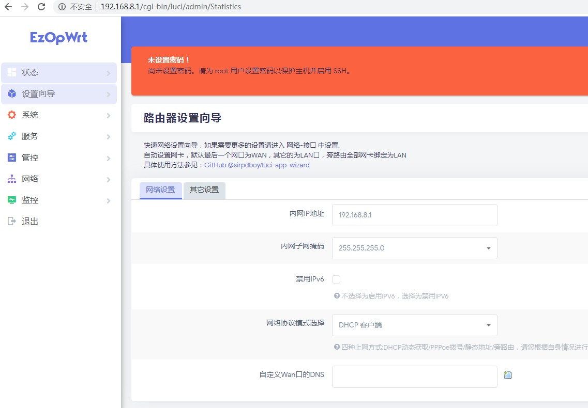
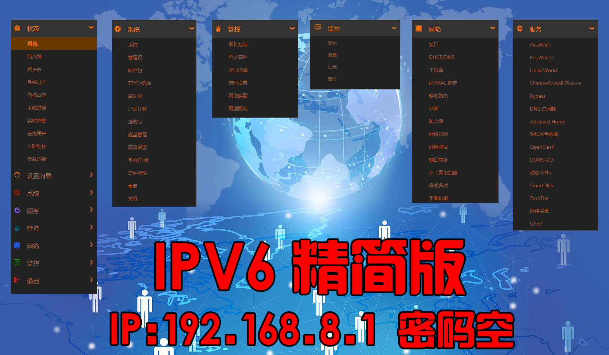

### 访问数：[] 

### [sirpdboy  X86固件分为：大全版，精典版，旁路由版，极致版，养老版等，其它如R2S、N1、小米硬路由机器等都是精典版，需要更多服务请定制！](https://github.com/sirpdboy/openwrt18.06/)
### 使用本固件前，请严格遵守国家互联网使用相关法律规定,不要违反国家法律规定！
<!-- TOC -->

  - [目录](#readme)
  - [免责声明](#免责声明)
  - [固件特色](#固件特色)
  - [文件说明](#文件说明)
  - [登陆密码](#登陆密码)  
  - [更新记录](#更新记录) 
  - [固件下载](#固件下载)
  - [固件界面](#固件界面)
  - [插件详情](#插件详情)
  - [源码来源](#源码来源)
  - [刷机教程](#刷机教程)
  - [捐助](#捐助) 

<!-- /TOC -->

------------------------------------------------------
请 **认真阅读完毕** 本页面，本页面包含注意事项和如何使用。

### 恩山链接2020年 ：https://www.right.com.cn/forum/thread-4013563-1-1.html
### 恩山链接2021年 ：https://www.right.com.cn/forum/thread-4053752-1-1.html
### 恩山链接2022年（最新） ：https://www.right.com.cn/forum/thread-8250453-1-1.html

## 免责声明

- 1.仅限完全行为能力人使用本固件，使用本固件即视为使用者的自愿行为;**
- 2.本人不对任何人因使用本固件所遭受的任何理论或实际的损失承担责任;**
- 3.本人不保证固件的普适性，不保证无bug，不保证绝对的安全稳定。**

## 本固件只在恩山论坛免费发布，未经许可，严禁私自扩散，严禁在淘某宝上出售本固件！ 

## 因精力有限不提供任何技术支持和教程等相关问题解答。不保证插件完全无BUG，特此公告！ 
 
- 1、固件上传之前，都是亲自有测试，不排除测试不全面有问题的可能**
- 2、本固件本人保证没加入任何后门**
- 3、强烈建议不保留配置刷入本固件，可以减少很多问题，如果此前是刷的本人固件可以同版本保留配置升级**
- 4、因为固件是在线编译，”IMG写盘工具“支持不太好，提示错误不影响正常使用，可直接压缩包升级或者用网盘中命令行刷机工具**
- 5、不管什么问题请先自己学习研究再寻求帮助，群里的人没有义务来帮你以及回复一些无聊与无知的问题，需要帮助的可以去某**

## 固件特色

【sirpdboy固件十大特色】
- 1.更简单的设置向导，可向导中一键设置：PPPOE拨号、上级路由、旁路由、以及IPV4和IPV6等设置。
- 2.固件自动绑定WAN口(默认eth1为WAN口)以外的所有网口为LAN口。免除刷机后只有一个LAN口(eth0)接口需要插拨网线的烦恼。
- 3.更详细的预览首页，显示连接网卡的接口和MAC，显示在线机器信息和更详细的物理硬件信息。
- 4.更高效的好用的管控插件：家长控制、网速限制、应用过滤、登陆管制以及更傻瓜的计划重启、关机、重连网络等定时控制管制功能。
- 5.完善的网络速度测试插件，网络检测工具（可设置断网重连），端口转发等工具。
- 6.所有版本集成分区扩容插件。新手福音，老手必备工具！自动网络挂载、自动高效的samba4网络文件共享，最大化开发出软路由NAS的网络传输性能。
- 7.CUPS的网络打印共享服务，更大化利用USB打印机，实现手机无线打印。
- 8.更傻瓜和高效的DDNS-GO动态域名服务，支持IPV4和IPV6协议，支持阿里，腾讯，华为等9大运营商。
- 9.驱动支持绝大多数的网卡和USB网卡，带部分无线网卡驱动。
- 10.集成时下流行的6种流学工具，根据不同需要有不同的版本，插件数量：Plus大全版>Mini精简版>Super极致版。

## 文件说明

- 文件下载请看日期文件名内容下载;
- 如文件名中：20200514表示是编译时间是2020年5月14日;
- 如文件名中：有IPV6表示支持IPV6的固件;
- 如文件名中：有EFI表示支持EFI快速引导模式，否则是标准BIOS模式;
- 如文件名中：有mini表示精简版本、Super表示极致版，Plus表示大全版，Bypass表示旁路由。
- 如文件名中：有R2S表示R2S机器使用版本
- 本固件基于lean大佬的源码编译。在此感谢所有无私奉献源码的大佬们！
 
## 重要说明

- 刷机完后软路由不再跑码停留在：Please press Enter to activate this console.表示启动成功，看到这个并不是说机器就完全启动好了，
还需要稍等几十秒才完全启动，过早回车看不到IP等是正常现象，取消跑码是为了解决有时系统出错导致一直不停跑码不能正常操作的问题。
- 本固件集成 一键网络设置向导插件，可一键设置IPV6和旁路由。
- 本固件取消重启设置插件，改“定时设置”插件，在管控菜单中。
- 管控中更多专属强大功能只为更方便更好用，有好建议欢迎参与开发。

## 登陆密码

- 2022年3月20日之前【固件IP】：192.168.1.1  密码： password或者 密码空
- 2022年3月20日【统一固件IP】：192.168.8.1  密码无 

## 更新记录

2023-1-13  更新6个版本：【sirpdboy独家优化】   （普通精简MINI版5.15.86/无应用商店/无docker + VIP大全PLUS版5.15.86/应用商店/docker + VIP精简MINI版5.15.86/应用商店/docker + VIP极致SUPER版5.4.203/应用商店/无docker + VIP旁路由BYPASS版5.4.203/应用商店/无docker + R2S/R4S VIP精简MINI版5.15.86/应用商店/无docker）

- 更新内容如下：【在上个版本的基础上优化更新如下】
- 1.【sirpdboy独家优化】升级adguardhome，修复LUCI下更新内核困难问题。
- 2.【sirpdboy独家优化】升级 应用过滤 5.0.2，彻底解决服务不正常问题，实时控制国内国外模式。
- 3. 取消最新版本MWAN3版本，负载均衡采用MWAN3 2.8.8-2  版本。
- 4.其他插件 同步更新到最新版本，具体请自行测试。

- 关注：https://t.me/sirpdboy_openwrt 【查看所有历史更新记录】

--------------------------------------------------------------------------------------

- 祝大家元旦快乐！！2023-1-1 X86更新7个版本：【sirpdboy独家优化】   （ 普通大全PLUS版5.15.85/无应用商店/docker   + 普通精简MINI版5.15.85/无应用商店/无docker   + 普通极致SUPER版5.15.85/无应用商店/无docker   + VIP大全PLUS版5.15.85/应用商店/docker + VIP精简MINI版5.15.85/应用商店/docker + VIP极致SUPER版5.4.203/应用商店/无docker + VIP旁路由BYPASS版5.4.203/应用商店/无docker）

- 1.【sirpdboy独家优化】升级大吉1.7.5，修复配置文件不能保留升级问题。
- 2.【sirpdboy独家优化】升级 设置向导 解决 某些浏览器偶尔登陆错误问题。
- 3.大全版增加下载aria2和transmission，服务不能启动一般是路径不对，修改正确存储路径。
- 4.所有版本集成分区扩容和设置向导。新手福音，老手必备工具！其他插件 同步更新到最新版本，具体请自行测试。

--------------------------------------------------------------------------------------

- 2022-12-16 X86更新5个版本：【sirpdboy独家优化】   （
- 普通精简MINI版5.15.83/无应用商店/无docker + VIP大全PLUS版5.15.83/应用商店/docker + VIP精简MINI版5.4.203/应用商店/docker + VIP极致SUPER版5.10.134/应用商店/docker + VIP旁路由BYPASS版5.10.134/应用商店/无docker ）

- 更新内容如下：【在上个版本的基础上优化更新如下】

- 1.【sirpdboy独家优化】升级ddns-go动态域名 到V4.3.3版
- 2.【sirpdboy独家优化】升级lucky 大吉1.74版，解决内存占用过高问题。
- 3.【sirpdboy独家优化】S酸乳+升级最新chinadns-ng
- 4.【sirpdboy独家优化】负载均衡mwan3 采用2.10.13版本，需自行配置。
- 5.【sirpdboy独家优化】家长控制升级，解决不指定MAC地址，限制不生效的问题。
- 6.【sirpdboy独家优化】应用过滤升级5.0.2版本，采用V2.0数据库格式，增加国内国外区域规则指定。
- 7.【sirpdboy独家优化】VIP极致和VIP旁路采用immortalwrt版本5.10内核.VIP精简采用immortalwrt版本5.4.203内核。其它采用lean版本5.15.83内核。
- 8.【sirpdboy独家优化】重新加回 arpbind，ARP绑定插件。VIP极致版将passwall改为passwall2.
- 9.【sirpdboy独家优化】优化bypass插件。解决偶尔无法上网问题。具体效果请大家测试告之 

--------------------------------------------------------------------------------------

2022-12-8更新5个版本：【sirpdboy独家优化】   （2022-12-8 X86更新5个版本：【sirpdboy独家优化】   （
普通极致SUPER版5.15.80/无应用商店/无docker +普通精简MINI版5.15.80/无应用商店/无docker  +VIP精简MINI版5.4.203/应用商店/docker +VIP极致SUPER版5.4.203/应用商店/无docker +VIP旁路由BYPASS版5.4.203/应用商店/无docker ）

- 更新内容如下：【在上个版本的基础上优化更新如下】
- 1.【sirpdboy独家优化】更新分区扩容插件，修复保留配置无效问题.
- 2.【sirpdboy独家优化】所有版本加回bypass插件。
-  3.【sirpdboy独家优化】更新预览脚本，增加AMD的温度显示，内存按G来表示。可识别虚拟网卡。
- 4.【sirpdboy独家优化】删除IPK安装签名可以软件包中更新大多数的插件。
- 5.【sirpdboy独家优化】修正nat回流问题。

2022-11-11更新：【sirpdboy独家优化】   （普通精简MINI版5.15.77/无应用商店/无docker + VIP大全PLUS版5.15.77/应用商店/docker + VIP精简MINI版5.15.77/应用商店/docker + VIP极致SUPER版5.15.77/应用商店/docker + VIP旁路由BYPASS版5.15.77/应用商店/无docker + VIP精简MINI版 R2S/R4S5.15.77/应用商店/docker）【庆双11特别版】

- 刷机说明：
- 1.由于经常有人问刷机哪个文件，现在EFI是BIOS和EFI通用文件，因此取消BIOS文件，大家刷机用EFI的文件就行。VIP版带的rootfs这个是给PVE的LXC容器使用，请勿弄错。
- 2.如果是PE刷机，请下载《刷机工具》中专用的物理机刷机IMG刷机工具。（在刷机前建议将原来硬盘分区全部删除保存重启再刷机）
- 3.关于旁路由说明，正常来说所有版本都可以在设置向导中设置为旁路由模式，旁路由版本也可以设置为主路由模式。

- 更新内容如下：【在上个版本的基础上优化更新如下】
- 1.修复SAMBA4网络共享不支持V1老协议问题。
- 2.修复不自动共享的问题。
- 3.修复R2S重启变只读问题。
- 4.VIP版取消固件自动扩展功能，预计下一个更新增加一键分区扩展LUCI插件。
- 5.修复NTFS3协议不自动挂载NTFS分区问题。
- 6.普通版本集成插件和上个版本基本相同。VIP版区别主要是BUG会更少，有问题更新会更多更及时，插件有一些不同，VIP版本都带有应用商店和大吉。
- 7.红米RM2100亲测稳定好用，可直接breed刷机和pbboot刷机升级，简单方便高效零风险。
- 8.修复目前已知所有问题，具体功能效果自行测试。

2022-11-1更新：【sirpdboy独家优化】   （VIP大全版5.15.76 内核/docker/应用商店 + VIP精简版5.15.76 内核/应用商店/docker + VIP旁路由5.15.76 内核/应用商店/无docker + 大全版5.15.76 内核/无docker/无应用商店+ 精简版5.15.76 内核/无docker/无应用商店 + 极致版/5.15.76 内核/无docker/无应用商店 +VIP区：R2S\R4S\小米R2100）

- 更新内容如下：【在上个版本的基础上优化更新如下】
- 1.【sirpdboy独家研发】升级网络测试2.0.5版，增加外网测试PFERNET等。
- 2.【sirpdboy独家研发】升级大吉1.5.1插件，集成：动态域名（多域名商多域名现时解析）,端口映射，内网反向代理，可保存恢复所有配置可外网登陆访问。 【VIP版带】
- 3.【sirpdboy独家研发】增加ddns-go动态域名插件，更好用的动态域名工具支持IPV4和IPV6。 
- 4.【sirpdboy独家优化】升级bypass插件,修正自动切换设置无效问题.更新状态信息解决偶尔测试谷哥网络测试错误问题。
- 5.【sirpdboy独家研发】刷机自动将未使用的硬盘空间分区并且自动扩展挂载到overlay应用空间，彻底解决应用空间不够问题。 【VIP版带】
- 6.普通版本集成插件和上个版本基本相同。VIP版区别主要是BUG会更少，有问题更新会更多更及时，插件有一些不同，VIP版本都带有应用商店和大吉。
- 7.红米RM2100亲测稳定好用，可直接breed刷机和pbboot刷机升级，简单方便高效零风险。
- 8.修复目前已知所有问题，具体功能效果自行测试。

## 附注意说明：感谢大家长期以来的支持与厚爱，之所以推一个VIP版，是因为疫情原因群主目前进入待业阶段，目前准备全力备战学习、研究、开发软路由等相关业务，发布VIP有爱发电也是希望借此能贴补一下家用（有爱的好伙伴支持后截图发唯一TG号：sirpdboy,然后进VIP群）。望体谅与支持！

2022-10-20更新：【sirpdboy独家优化】   （精简VIP贵宾版5.15.74 内核/docker/应用商店 + 精简MINI版无docker无应用商店/5.15.74 内核 + 红米RM2100 极致5.10内核 breed和pbboot版）

- 更新内容如下：【在上个版本的基础上优化更新如下】
- 1.【sirpdboy独家研发】升级网络测试2.0版，增加内网测试WEB版，更新IPFER3服务实时更新，宽带速度测试详细报告等。
- 2.【sirpdboy独家研发】增加大吉插件，集成：动态域名ddns-go服务, socat端口映射，FRP内网穿透功能。 【VIP版带】
- 3.【sirpdboy独家研发】增加ddns-go动态域名插件，更好用的动态域名工具支持IPV4和IPV6。 
- 4.【sirpdboy独家优化】升级netdata插件，可以控制服务和端口了,再也不怕取消服务还强占内存问题。
- 5.更新DOCKER图标到主菜单【VIP版带】
- 6.修复单网卡情况导致LAN口配置信息丢失不能登陆后台问题。
- 7.精简版增加CUPS打印服务器插件，ddns-go动态域名插件和netdata插件.
- 8.红米RM2100亲测稳定好用，可直接breed刷机和pbboot刷机升级，简单方便高效零风险。
- 9.修复目前已知所有问题，具体功能效果自行测试。

## 附注意说明：感谢大家长期以来的支持与厚爱，之所以推一个VIP版，是因为疫情原因群主目前进入待业阶段，目前准备全力备战学习、研究、开发软路由等相关业务，发布VIP有爱发电也是希望借此能贴补一下家用（有爱的好伙伴支持后截图发唯一TG号：sirpdboy,然后进VIP群）。望体谅与支持！

## 2022-10-13更新【sirpdboy独家优化】 （IPV6大全版 5.15.72 内核【带DOCKER】 + IPV6精简版 5.15.72 内核 + IPV6极致版 5.15.72 内核  + R2S精简版  + R4S精简版 )

- 更新内容如下：【在上个版本的基础上优化更新如下】
- 1.【sirpdboy独家研发】修复WAN口绑定成WAN和LAN导致冲突问题。
- 2.【sirpdboy独家研发】升级DDNS-GO动态域名插件4.1.0版,可同页面设置。支持IPV6，支持：阿里,腾讯云,Cloudflare,华为,Callback,百度,porkbun, GoDaddy等.【极致版无】
- 3.【sirpdboy独家优化】升级upnp，加入外网接口和内网地址二个参数，并且自动设置。
- 4.大全版加回上版本遗失的插件，同时还增加部分INTEL驱动和插件。
- 5.R2S，R4S应TG群网友反应加回helloworld插件。
- 6.修复目前已知所有问题，具体功能效果自行测试。

## 2022-10-01更新【sirpdboy独家优化】 （IPV6大全版 5.15.70 内核【带DOCKER】 + IPV6精简版 5.15.70 内核 + IPV6极致版 5.15.70 内核  + R2S精简版  + R4S精简版 )

- 更新内容如下：【在上个版本的基础上优化更新如下】
- 1.【sirpdboy独家研发】更新首页概览，解决PVE的lxc概览显示不全和部分机器网络接口错误问题,概览增加在线用户列表。
- 2.升级samba4 增加禁用启用功能。
- 3.彻底解决 NTFS移动硬盘不自动挂载以及NTFS分区挂载后只读的问题。
- 4.【sirpdboy独家研发】增加DDNS-GO动态域名插件。支持IPV6，支持：阿里,腾讯云,Cloudflare,华为,Callback,百度,porkbun, GoDaddy等.【极致版无】
- 5.更新流量统计，修复统计时偶尔负载过高的问题.
- 6.修复 <网络检测> 插件 断线重拨 无效问题.
- 7.修复 <定时设置> 插件 重新拨号 无效问题.
- 8.【sirpdboy独家研发】增加cups打印机共享插件，修复不能停止服务和无法更改端口等问题。【极致版无】
- 9.ACC网络加速用"软件流量分载"，取消容易导致不稳定或重启的"SHORTCUT_FE_CM" 【极致版无】
- 9.增加 IPV4旁路由5.4.203内核带DOCKER带应用商店版本。
- 0.修复目前已知所有问题，具体功能效果自行测试。

## 20220926--庆国庆【带应用商店】【带dokcer】精典ipv4-mini 5.4.203内核【旁路由尝鲜版】下载： https://we.tl/t-g1lBS0Cbwc 【三天有效期】

- 更新内容如下：【在上个版本的基础上优化更新如下】
- 1.更新首页概览，解决PVE的lxc概览显示不全和部分机器网络接口错误问题,增加在线用户列表。
- 2.升级samba4 增加禁用启用功能。
- 3.彻底解决 NTFS移动硬盘不自动挂载以及NTFS分区挂载后只读的问题。
- 4.增加DDNS-GO动态域名插件。支持IPV6的域名，支持服务商：阿里,腾讯云,Cloudflare,华为,Callback,百度,porkbun, GoDaddy等【sirpdboy独家首发】
- 5.更新流量统计，修复统计时偶尔负载过高的问题.
- 6.修复 <网络检测> 插件 断线重拨 无效问题.
- 7.修复 <定时设置> 插件 重新拨号 无效问题.
- 8.修复目前已知所有问题，具体功能效果自行测试。

## 2022-9-15更新：【sirpdboy独家优化】 （IPV6大全版 5.15.67 内核【带DOCKER】 + IPV6精简版 5.15.67 内核 + IPV6极致版 5.15.67 内核  ）
- 更新内容如下：【在上个版本的基础上优化更新如下】
- 1.端口映射用回socat。
- 2.更新ACC加速默认Shortcut-FE内核，默认选择NAT1。
- 3.常规更新 ,大全版个别插件可能会有增减，具体功能效果自行测试。
- 
## 2022-9-1更新：【sirpdboy独家优化】 （IPV6大全版 5.15.63 内核【带DOCKER】 + IPV6精简版 5.15.63 内核 + IPV6极致版 5.15.63 内核  + R2S精简版  + R4S精简版 
- 更新内容如下：【在上个版本的基础上优化更新如下】
- 1.更新监控插件，状态菜单中加入“在线用户”，监控菜单加入“实时网速”。
- 2.更新AdGuardHome配置，解决参数错误导致不能正常启动服务的问题。
- 3.大全版取消可道云和UHTTP插件，换功能更强大的Alist文件插件。
- 4.固件状态中加入固件版平台识别引导模式UEFI（在固件启动回车后可以看到，也可以首页预览中看到）
- 5.更换端口映射工具为homeredirect，支持DOCKER和IPV6.
- 6.大全和精简版增加sirpdboy版应用过滤 。新功能 ：自动更新和自定义过滤库。
- 7.大全和精简版 增加和alist文件管理。
- 8.修复目前已知所有问题，具体功能效果自行测试。

## 2022-8-22更新：【sirpdboy独家优化】     （IPV6大全版  5.15.60 内核【带DOCKER】 + IPV6精简版  5.15.60 内核  + IPV6极致版  5.15.60 内核  】  【养老版】
- 1.更新bypass修复更新地址库慢、修复GFW模式TG无法使用问题，优化日志显示等。
- 2.更新ACC加速默认Shortcut-FE内核，取消NAT1和ACC加速，需要使用的自行打勾使用。
- 3.更新主题opentopd和adgron,彻底修复个别插件点击后收缩问题。
- 4.更新AdGuardHome过滤链接库，解决不能正常启用的问题。
- 5.更新 应用过滤5.0，支持旁路由。
- 6.修复目前已知所有问题，具体功能效果自行测试。 

## 2022-7-15更新：【sirpdboy独家优化】     （IPV6大全版  5.15.54 内核【带DOCKER】 + IPV6精简版  5.15.54 内核  + IPV6极致版 5.15.54 内核  】
- 1.完善自动识别网卡脚本。保留配置升级不会丢失WAN口参数。
- 2.升级bypass插件，高级设置中增加规则自定义，修复GFW模式百度延时大问题。
- 3.同步更新所有插件到最新版本.
- 4.修复目前已知所有问题，具体功能效果自行测试。 

## 2022-7-1更新：【sirpdboy独家优化】     （IPV6大全版  5.15.50  内核【带DOCKER】 + IPV6精简版  5.15.50 内核  + IPV6极致版 5.15.50 内核  】
- 1.增加常见无线驱动,名称自动区分：OP-2.4G和OP-5G，密码：12345678
- 2.优化预览首页 温度等显示代码.
- 3.修复 新内核 【家长控制】 插件无效问题 .
- 4.升级 设置向导 插件，优化设置界面和代码，使之更方便高效. 
- 5.修复日志中DHCP服务导致的错误提示。
- 6.更新高级设置，取消和向导相同功能的旁路由及IPV6功能设置，分离文件管理插件。
- 7.修复目前已知所有问题，基本无BUG。 

## 2022-6-1更新：【sirpdboy独家优化】     （IPV6大全版  5.15.41  内核【带DOCKER】 + IPV6精简版 5.15.41内核  + IPV6极致版 5.15.41 内核  ）  【养老版】
- 在上个版本的基础上优化更新如下：
- 1.增加常见无线驱动,名称自动区分：OP-2.4G和OP-5G，密码：12345678
- 2.增加预览首页实时【CPU主频】显示.
- 3.驱动大全再加上bcm5719驱动（待测试）
- 4.升级netdata1.33.1汉化版本。
- 5.更新bypass不能导入和导出节点等问题
- 6.新打包rootfs文件，PVE使用LCX容器的福音。
- 7.修复上个版本MWAN3负载没有负载信息问题.
- 8.修复adguardhome内核更新导致不能进入的问题
- 9.增加主题 darkmatter和neobird。
- 10.修复上个版系统日志循环eth1报错等问题.。
- 11.由于KPR不支持5.15内核，全线下架换成[广告屏蔽大师]。

## 2022-5-1更新：【sirpdboy独家优化】     （IPV6大全版  5.15.36  内核【不带DOCKER】 + IPV6精简版 5.15.36内核 【带DOCKER】+ IPV6精简版 5.15.36内核  + IPV6极致版 5.15.36 内核  + R2S IPV6精简版 5.15.36内核 + R4S IPV6精简版 5.15.36内核）  
- 更新内容如下：【在上个版本的基础上优化更新如下】
- 1.修复流量统计，标记二台未知设备的名字【总有人不知道二个未知的MAC是什么机器在偷跑流量，其实是LAN 和WAN二个接口】。
- 2.提高网络管控，升级时间控制为家长控制，可时间控制，协议过滤，端口过滤，黑名单模式等。
- 3.新加登入管控插件，增加OPENWRT安全性。【所有版本】
- 4.新加断线检测执行指定任务功能【所有版本】
- 5.升级多拨带IPV6功能。【除极致版外】
- 6.升级MWAN3多线负载支持IPV6，此版本配置是默认配置带WAN6负载均衡。【除极致版外】
- 7.加回open-vm-tools取消qemu-ga。
- 8.zerotier取消新版防火墙功能返回老版本。
- 9.增加Tailscale依赖。【TG群内测群友推荐】
- 10.PASSwall升级最新版本。
- 11.所有版本集成群主自用版bypass和增加smartdns，修复已知问题。【源码来自OVERWALL】

## 固件下载

-【123云盘工具下载】链接: https://www.123pan.com/s/dS5A-Hoxqd   提取码:MwhD
-【123云盘固件下载】链接: https://www.123pan.com/s/dS5A-nJxqd    提取码:nxFY
- Telegram聊天群组: https://t.me/joinchat/RV6mxIxZJVDByibQ
- 加入固件电报群：https://t.me/joinchat/AAAAAEpRF88NfOK5vBXGBQ 

## 固件界面

## 插件详情

## 源码来源

***本固件基于lean大佬的源码编译，外加一些额外的软件包，主要使用源码如下：***
### https://github.com/coolsnowwolf/lede
### https://github.com/sirpdboy/sirpdboy-package (sirpdboy插件源码仓库）

**感谢LEAN大，感谢Lienol大 等大神分享源码，你可以随意使用其中的源码，但请注明出处。**

# My other project
- 网络速度测试 ：https://github.com/sirpdboy/NetSpeedTest
- 定时设置插件 : https://github.com/sirpdboy/luci-app-autotimeset
- 关机功能插件 : https://github.com/sirpdboy/luci-app-poweroffdevice
- opentopd主题 : https://github.com/sirpdboy/luci-theme-opentopd
- opentoks 主题: https://github.com/sirpdboy/luci-theme-opentoks [仿KOOLSAHRE主题]
- btmob 主题: https://github.com/sirpdboy/luci-theme-btmob
- 系统高级设置 : https://github.com/sirpdboy/luci-app-advanced
- ddns-go动态域名: https://github.com/sirpdboy/luci-app-ddns-go

## 捐助

|       |    | 
| :-----------------: | :-------------: |
| |  |

## 赞助名单

***Li                  赞助66元

***风                  赞助100元

***人                  赞助100元

**j*g                  赞助200元

***ㄎ                  赞助15元

***群                  赞助50元

***看                  赞助8.8元

***洋                  赞助5元

***畅                  赞助50元

***石                  赞助7.77元

***阳                  赞助66.66元

***儒                  赞助10元

***斌                  赞助10元

**C*o                  赞助20元

***洗                  赞助30元

**p*k                  赞助50元

**KK                   赞助600元

**潮                   赞助50元

## 捐助

## 刷机教程

## DD刷机教程 ：

